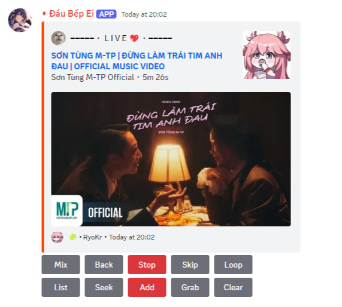

# MeowBot - Discord Bot


## Prerequisites

Before you begin, make sure you have the following installed:

- **[Node.js](https://nodejs.org/en/)** `Version 18.20.2`
- **[FFMPEG](https://www.ffmpeg.org/)** `Lastest`


## Installation

1. **Clone the Repo**

    ```bash
    git clone https://github.com/ryokr/MeowBot.git
    ```

2. **Navigate to the Project Directory**

    ```bash
    cd MeowBot
    ```

3. **Install Dependencies**

    ```bash
    npm i
    ```


## Bot Permissions

To ensure MeowBot works properly, set the following permissions:

- **Application Scope** Enable `applications.commands` `bot` in the **OAuth2** tab on [Dev Portal](https://discord.com/developers/applications/).

- **Intents** Enable `PRESENCE INTENT` `SERVER MEMBERS INTENT` `MESSAGE CONTENT INTENT` in the **Bot** tab on [Dev Portal](https://discord.com/developers/applications/).


## Configuration

1. **Create Variables**

    Create the `.env` file in `MeowBot` folder.

2. **Customize Bot Status**

    Copy and paste the content below to `.env` file u have created.
    
    - `token`   - `String` The token of your bot.
    - `status`  - `String` Can be `online`, `ilde`, `dnd`.
    - `name`    - `String` Name of your activity. Ex: Genshin Impact.
    - `state`   - `String` More info about activity. Ex: For 69 hours.
    - `type`    - `Integer` 0 - Play, 1 - Stream, 2 - Listen, 3 - Watch, 4 - Custom, 5 - Compete.
    - `color`   - `String - HEX Format` Color of the embeds

    **Template**
    ```
    token = PUT_YOUR_TOKEN_HERE 

    status = BOT_STATUS
    name = ACTIVITY_NAME
    state = ACTIVITY_STATE
    type = ACTIVITY_TYPE

    color = YOUR_BOT_COLOR
    ```

    **Example**
    ```
    token = 123456

    status = idle
    name = Genshin Impact
    state = From RyoKr With Luv
    type = 0

    color = ff4400
    ```

## Starting the Bot

To start MeowBot, run:

```bash
node index.js
```

## Commands

- `play`    -> Plays the requested song in voice channel you are in.
- `search`  -> Search the requested song.
- `skip`    -> Skip currently playing song.
- `stop`    -> Stop the music and clear the queue.
- `remove`  -> Remove a song at specific position.
- `filter`  -> Change the filter.
- `volume`  -> Change player volume.


## Hosting

> This bot can be hosted anywhere that supports `Node.js`. Make sure to include `FFMPEG`.

## Support

> Contact me [ryohuy2410](https://discord.gg/fTuGFk9ayG) for any issue.

## Credits

> If you consider using this Bot, make sure to credit me ><.
> Example: `From [ryohuy2410](https://discord.gg/fTuGFk9ayG) with luv, meowed by [modifier/your Name](<url>)` :3.